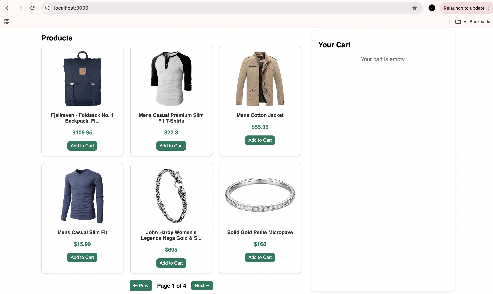
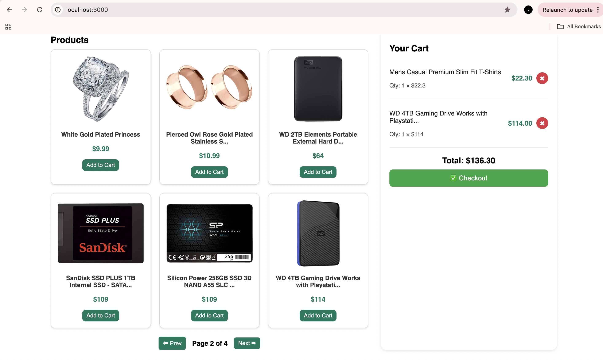

# 🛒 Mock E-Commerce Cart (Vibe Commerce Internship Assignment)

A simple **full-stack shopping cart** web app built using **React (frontend)** and **Node.js + Express + MongoDB (backend)**.  
Implements basic e-commerce flows like adding/removing products, calculating totals, and mock checkout.

---

## 🚀 Project Overview

This project was created as part of the **Vibe Commerce Full Stack Internship assignment**.

### Features
- Display products (fetched from [Fake Store API](https://fakestoreapi.com/))
- Add/remove items from cart
- Show cart total dynamically
- Checkout form (name/email) + receipt modal
- Responsive design (works on mobile and desktop)
- MongoDB persistence (mock user so data stays after refresh)
- Bonus: Pagination + error handling

---

## 🧩 Tech Stack

| Layer | Technology |
|--------|-------------|
| **Frontend** | React.js + Axios |
| **Backend** | Node.js + Express |
| **Database** | MongoDB (via Mongoose) |
| **External API** | [FakeStoreAPI](https://fakestoreapi.com/products) |

---

## Backend Setup
cd backend
npm install
npm start

## Frontend Setup
cd frontend
npm install
npm start

## MongoDB Setup (Optional Bonus)
If you have MongoDB installed locally or on Atlas:

The backend automatically connects to your local instance (mongodb://127.0.0.1:27017/vibe_commerce)

A single “mock user” (user1) is used for cart persistence

This allows the cart data to remain even after restarting the backend.

## Note: 
I used AI tools (ChatGPT) to assist with debugging, architecture suggestions, and documentation. All code was reviewed, tested, and understood by me.

## 🖼️ Screenshots

### 🛍️ Products Page

### 🛒 Cart View

